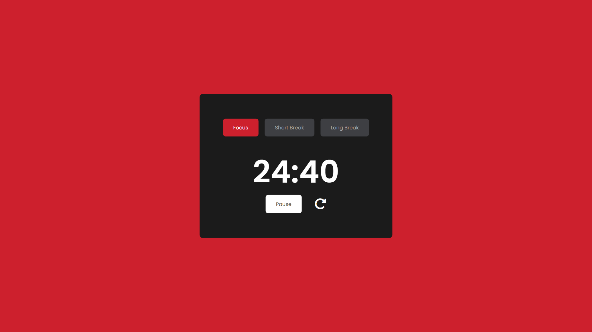

# Pomodoro Timer Web Template

## Overview

The **Pomodoro Timer Web Template** is a simple and elegant web-based tool designed to help users manage their time using the Pomodoro Technique. This template provides a user-friendly interface for setting work intervals and breaks, helping to boost productivity and maintain focus.

## Features

- **Customizable Timer**: Set custom durations for work and break intervals.
- **Responsive Design**: Works on all devices, including desktops, tablets, and mobile phones.
- **Simple and Clean UI**: Easy-to-use interface with a minimalist design.
- **Sound Notifications**: Alerts users when the timer ends.
- **Progress Tracking**: Visual representation of time left in each session.

## Screenshot



## Technologies Used

- **HTML**: For the structure of the web pages.
- **CSS**: For styling and layout.
- **JavaScript**: For timer functionality and interactivity.

## Installation

To use the Pomodoro Timer web template, you can clone the repository and open the `index.html` file in your preferred web browser.

```bash
git clone https://github.com/diyorbekqodirboyev863/pomodoro-timer.git
cd pomodoro-timer
```

## Usage

1. Clone the repository.
2. Navigate to the project directory.
3. Open `index.html` in a web browser.
4. Set your desired work and break intervals.
5. Start the timer and manage your work sessions efficiently!

## Contribution

Contributions are welcome! If you have any improvements or suggestions, please feel free to open an issue or submit a pull request.

## License

This project is licensed under the MIT License. See the [LICENSE](LICENSE) file for details.

## Author

[Diyorbek Qodirboyev](https://github.com/diyorbekqodirboyev863)